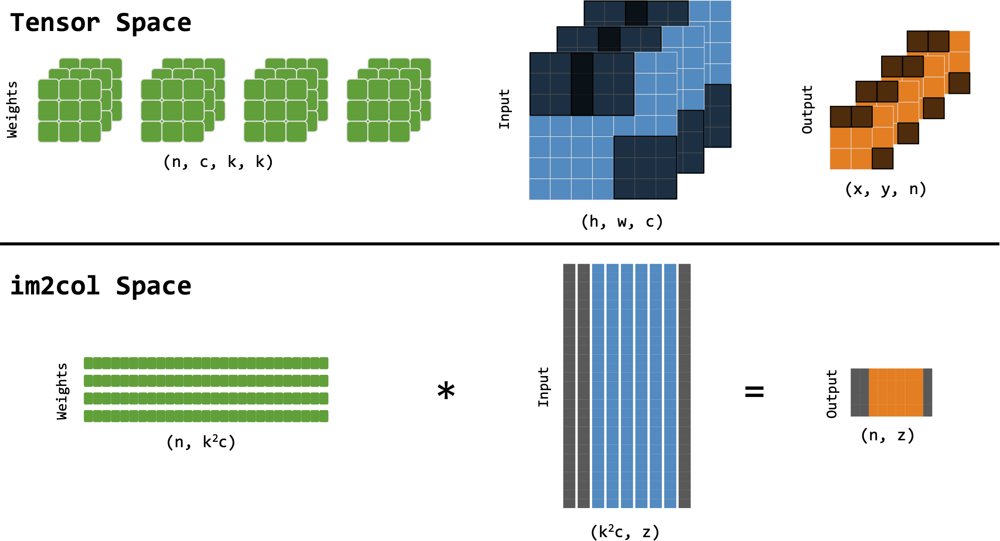

<div align="center">

  <h2 align="center">Accelerating Deep Neural Networks via Semi-Structured Activation Sparsity</h3>

  <a href="https://arxiv.org/abs/2309.06626" target="_blank"></a>
</div>


<p align="center">
   <br>
  Activation sparsity pattern in the tensor vs im2col spaces.
</p>

>[Accelerating Deep Neural Networks via Semi-Structured Activation Sparsity](https://arxiv.org/abs/2309.06626)<br>
>[Matteo Grimaldi](https://scholar.google.ca/citations?user=Li60pj4AAAAJ&hl=en), [Darshan C Ganji](https://ca.linkedin.com/in/darshancganji), [Ivan Lazarevich](https://scholar.google.ca/citations?user=dRezqREAAAAJ&hl=en&oi=sra), [Sudhakar Sah](https://scholar.google.ca/citations?user=Ruq8ZywAAAAJ&hl=en&oi=sra)<br>
>Deeplite Inc.<br>
>[Workshop on Resource Efficient Deep Learning for Computer Vision, ICCV23](https://iccv2023.thecvf.com/)<br>


<details>
  <summary>
  <font size="+1">Abstract</font>
  </summary>
The demand for efficient processing of deep neural networks (DNNs) on embedded
devices is a significant challenge limiting their deployment. Exploiting
sparsity in the network's feature maps is one of the ways to reduce its
inference latency. It is known that unstructured sparsity results in lower
accuracy degradation with respect to structured sparsity but the former needs
extensive inference engine changes to get latency benefits. To tackle this
challenge, we propose a solution to induce semi-structured activation sparsity
exploitable through minor runtime modifications. To attain high speedup levels
at inference time, we design a sparse training procedure with awareness of the
final position of the activations while computing the General Matrix
Multiplication (GEMM). We extensively evaluate the proposed solution across
various models for image classification and object detection tasks. Remarkably,
our approach yields a speed improvement of 1.25× with a minimal accuracy drop of
1.1% for the ResNet18 model on the ImageNet dataset. Furthermore, when combined
with a state-of-the-art structured pruning method, the resulting models provide
a good latency-accuracy trade-off, outperforming models that solely employ
structured pruning techniques.
</details>

<br>


## Classification on ImageNet-1K

### ResNet18

* Dense baseline: 70.53 %

| Sparsity | Top-1 | Speedup |
|:-----:|:-----:|:-------:|
| 0.1   | 70.48 % |   1.11 $\times$    |
| 0.2   | 69.42 % |   1.25 $\times$    |
| 0.3   | 67.88 % |   1.42 $\times$    |

### MobileNetV2

* Dense baseline: 72.19 %

| Sparsity | Top-1 | Speedup |
|:-----:|:-----:|:-------:|
| 0.1   | 70.43 % |   1.04 $\times$    |
| 0.2   | 69.94 % |   1.10 $\times$    |
| 0.3   | 67.92 % |   1.20 $\times$    |


## Training Setup

### Prerequisites

```
source setup.sh
```

### Single machine multi-GPU training

We provide an example script for training ResNet18 on Flowers102 dataset.

```
sh examples/run_resnet18_flowers102.sh
```

## Latency Measurement

The latency speedup was measured on a Raspberry Pi 4B device, featuring a
quad-core ARM Cortex-A72 processor operating at 1.5GHz, with 4GB of RAM.
For deployment, we used TFLite inference engine built with XNNPACK delegate with
custom modifications for sparse inference. When `--save_masks` is enabled during
training, binary masks are stored as `.h` header files to include in the inference routine. 


## Citation

If our code or models help your work, please cite our paper:
```BibTeX
@article{grimaldi2023accelerating,
  title={Accelerating Deep Neural Networks via Semi-Structured Activation Sparsity},
  author={Grimaldi, Matteo and Ganji, Darshan C and Lazarevich, Ivan and Sah, Sudhakar},
  journal={arXiv preprint arXiv:2309.06626},
  year={2023}
}
```
